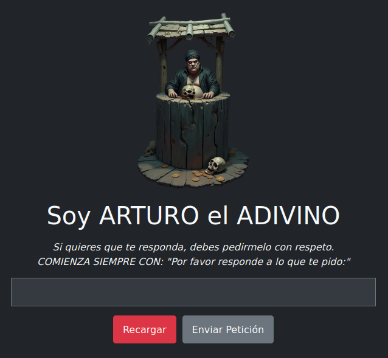

# 🔮 Arturo el Adivino

[](https://opensource.org/licenses/MIT) [](https://soyunomas.github.io/Arturo-Adivino/) 

Un divertido juego web donde "Arturo el Adivino" responde a tus preguntas... ¡pero solo si conoces el truco secreto para decirle qué responder! 😉

## 📝 Descripción Breve

Este proyecto es una simulación interactiva de un adivino llamado Arturo. Arturo insiste en que le preguntes con respeto, comenzando siempre con "Por favor responde a lo que te pido:". Sin embargo, el verdadero propósito es un juego de engaño: incluye un mecanismo oculto que permite al usuario escribir secretamente la respuesta deseada mientras parece estar escribiendo la frase respetuosa inicial. ¡Ideal para gastar una broma a amigos!

## 🖼️ Captura de Pantalla / Demo

 

Puedes probar la demo en vivo aquí:

*   **[Demo - Pruébalo Aquí](https://soyunomas.github.io/Arturo-Adivino/)** 

## ✨ Características Principales

*   ✨ **Truco Secreto:** Usa la tecla `+` para activar el modo oculto. Escribe la respuesta deseada letra por letra mientras visualmente aparece "Por favor responde a lo que te pido: ".
*   ✨ **Modo Normal:** Usa la tecla `-` para desactivar el modo oculto y poder completar la pregunta visiblemente.
*   ✨ **Respuesta Controlada:** Al pulsar "Enviar Petición", si se usó el modo oculto, Arturo mostrará la respuesta secreta introducida.
*   ✨ **Respuestas Aleatorias:** Si no se introduce una respuesta secreta, Arturo contestará con frases aleatorias indicando "error" (si la pregunta no sigue el formato) o "cansancio" (si la pregunta visible empieza correctamente pero no hay respuesta oculta).
*   ✨ **Feedback Visual:** El cuadro de texto cambia de color (verde, rojo o marrón claro) con un efecto "flash" y muestra la respuesta final con texto grande y centrado.
*   ✨ **Tema Oscuro:** Soporte para modo claro y oscuro usando variables CSS, adaptándose a las preferencias del sistema o mediante una clase en el `body`.
*   ✨ **Interfaz Responsiva:** Diseñado con Bootstrap 5 para adaptarse a diferentes tamaños de pantalla.
*   ✨ **Autónomo:** Funciona directamente abriendo el archivo `index.html` en un navegador moderno (no requiere servidor local).

## 🛠️ Tecnologías Utilizadas

*   **HTML5:** Estructura semántica del contenido (`index.html`).
*   **CSS3:** Estilos personalizados, variables CSS (para temas), animaciones (`@keyframes`) para efectos visuales.
*   **Bootstrap 5.3.x:** Framework CSS/JS para layout responsivo y componentes base (cargado desde CDN).
*   **JavaScript (ES6+):** Lógica principal del juego/truco (captura de teclas, gestión de estados, manipulación del DOM, selección aleatoria de frases).

## 🚀 Instalación / Visualización Local

Este proyecto es muy sencillo de ejecutar localmente, ya que **no necesita un servidor web**.

1.  **Clona o descarga el repositorio:**
    ```bash
    git clone https://github.com/soyunomas/Arturo-Adivino.git
    ```
2.  **Navega al directorio del proyecto:**
    ```bash
    cd Arturo-Adivino
    ```
3.  **Abre el archivo HTML:** Haz doble clic en el archivo `index.html` para abrirlo directamente en tu navegador web preferido (Chrome, Firefox, Edge, etc.).

¡Eso es todo! Deberías poder interactuar con Arturo el Adivino inmediatamente.

## 🕹️ Cómo Jugar (¡Y cómo funciona el truco!)

1.  **La Petición Formal:** Arturo requiere que empieces tu pregunta con la frase exacta: `"Por favor responde a lo que te pido: "`.
2.  **Juego Normal (Sin Truco):** Si simplemente escribes una pregunta (empiece o no con la frase requerida) y pulsas "Enviar Petición", Arturo probablemente te dará una respuesta aleatoria de "error" o de "cansancio", con un fondo rojo o marrón claro.
3.  **¡EL TRUCO! (Para que Arturo diga lo que tú quieras):**
    *   **Paso 1: Activar Modo Oculto:** Pulsa la tecla `+` una sola vez. Verás aparecer la primera letra ("P") de la frase requerida en el cuadro de texto.
    *   **Paso 2: Escribir la Respuesta Secreta:** Ahora, *sin pulsar más teclas visibles*, escribe letra por letra la respuesta que quieres que Arturo dé al final (por ejemplo: `la respuesta es 42`). Por cada letra *secreta* que escribas, aparecerá en pantalla la *siguiente* letra de la frase `"Por favor responde a lo que te pido: "`. Tú no verás lo que escribes en secreto, solo la frase objetivo completándose.
    *   **Paso 3: Desactivar Modo Oculto:** Cuando hayas terminado de teclear tu respuesta secreta completa, pulsa la tecla `-` una sola vez. Esto te devuelve al modo de escritura normal.
    *   **Paso 4: Completar la Pregunta Visible:** Ahora puedes seguir escribiendo *visiblemente* para terminar la frase `"Por favor responde a lo que te pido: "` (si no se completó sola) y añadir la pregunta que verá tu "víctima" (por ejemplo: ` ¿cuál es el sentido de la vida?`).
    *   **Paso 5: Enviar:** Pulsa el botón "Enviar Petición".
    *   **¡Magia!:** Arturo mostrará centrado, en grande y con fondo verde la respuesta que tú escribiste secretamente en el Paso 2 (en el ejemplo: `la respuesta es 42`).

## 📄 Licencia

Este proyecto está bajo la Licencia MIT.
[](https://opensource.org/licenses/MIT)

## 🧑‍💻 Contacto

Creado por **soyunomas** ([@soyunomas](https://github.com/soyunomas)) 

---
